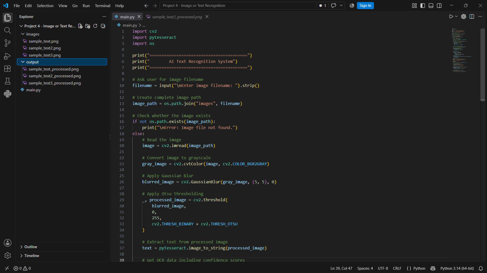
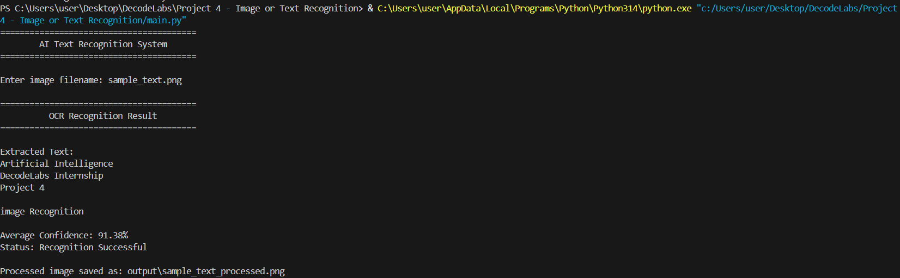
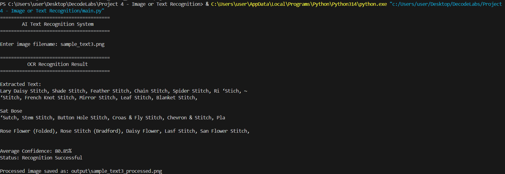

# AI Text Recognition System

## Project Overview

This project is a basic Optical Character Recognition (OCR) system developed for DecodeLabs Artificial Intelligence Internship Project 4.

The system extracts text from images using Tesseract OCR and OpenCV. Image preprocessing techniques are applied before recognition to improve text readability and OCR performance.

## Features

- Accepts an image filename as user input
- Loads images using OpenCV
- Converts images to grayscale
- Applies Gaussian Blur for noise reduction
- Uses Otsu Thresholding for image preprocessing
- Extracts text using Tesseract OCR
- Calculates the average OCR confidence score
- Validates recognition using an 80% confidence threshold
- Saves the processed image automatically
- Handles invalid image filenames

## Technologies Used

- Python
- OpenCV
- Tesseract OCR
- pytesseract
- Python os module

## How It Works

1. The user enters the name of an image stored in the `images` folder.
2. OpenCV loads the selected image.
3. The image is converted to grayscale.
4. Gaussian Blur is applied to reduce image noise.
5. Otsu Thresholding converts the image into a high-contrast binary image.
6. Tesseract OCR extracts text from the processed image.
7. OCR confidence values are collected and used to calculate an average confidence score.
8. The system checks whether the average confidence is at least 80%.
9. The extracted text, confidence score, and recognition status are displayed.
10. The processed image is saved in the `output` folder.

## Project Structure

    Project 4 - Image or Text Recognition/
    │
    ├── main.py
    ├── README.md
    │
    ├── images/
    │   ├── sample_text.png
    │   ├── sample_text2.png
    │   └── sample_text3.png
    │
    ├── output/
    │   ├── sample_text_processed.png
    │   ├── sample_text2_processed.png
    │   └── sample_text3_processed.png
    │
    └── screenshots/
        ├── project_code.png
        ├── ocr_clean_result.png
        └── ocr_complex_result.png

## Installation

Install the required Python libraries:

    pip install opencv-python
    pip install pytesseract

Tesseract OCR must also be installed on the system before running the project.

## How to Run

Run the program using:

    python main.py

When prompted, enter an image filename such as:

    sample_text.png

The image must be available inside the `images` folder.

## Test Results

| Test Image | Average Confidence | Status |
|---|---:|---|
| sample_text.png | 91.38% | Recognition Successful |
| sample_text2.png | 88.44% | Recognition Successful |
| sample_text3.png | 80.85% | Recognition Successful |

All three test images achieved the minimum 80% confidence threshold used for project validation.

## Screenshots

### Project Code and Structure

### Clean OCR Recognition Result

**Confidence:** 91.38%

### Complex OCR Recognition Result

**Confidence:** 80.85%

## Learning Outcomes

Through this project, I learned how to:

- Integrate an OCR engine with Python
- Process images using OpenCV
- Apply grayscale conversion, Gaussian Blur, and thresholding
- Extract machine-readable text from images
- Interpret OCR confidence scores
- Validate recognition results using a confidence threshold
- Build a reusable image-to-text recognition workflow

## Conclusion

This project demonstrates a basic AI-powered text recognition pipeline using OpenCV and Tesseract OCR. The system preprocesses input images, extracts text, evaluates recognition confidence, and saves processed results.

Testing on multiple images demonstrated how image complexity can affect OCR accuracy while showing that the recognition pipeline can successfully process both clean and more challenging text images.

## Author

Khawaja Muhammad Ali Ghauri

Artificial Intelligence Intern — DecodeLabs  
Project 4: AI Text Recognition System